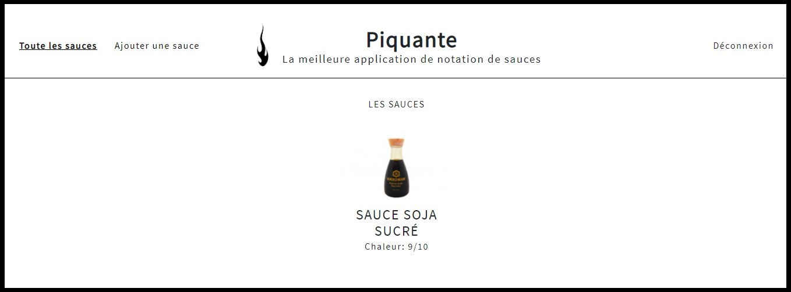

 

<h1 align="center">So Pekocko - Projet 6</h1>

Construire une API sécurisée pour une application d'avis gastronomique
 

  
Sommaire

  <ol>
    <li>
      <a href="#apropos">A propos du Site</a>
      <ul>
        <li><a href="#outils">Outils utilisés</a></li>
        <li><a href="#doc">Documentation</a></li>
      </ul>
    </li>
    <li>
      <a href="#demarrage">Démarrage</a>
      <ul>
        <li><a href="#prerequis">Prérequis</a></li>
        <li><a href="#installation">Installation</a></li>
      </ul>
    </li>
    <li><a href="#contact">Contact</a></li>
  </ol>

<h2 id="apropos">A propos du Site</h2>

So Pekocko est une entreprise familiale de 10 salariés. Son activité principale est la création
de sauces piquantes dont la composition est tenue secrète. Forte de son succès, l’entreprise
souhaite se développer et créer une application web, dans laquelle les utilisateurs pourront
ajouter leurs sauces préférées et liker ou disliker les sauces proposées par les autres.

<h3 id="#outils">Outils utilisés</h3>