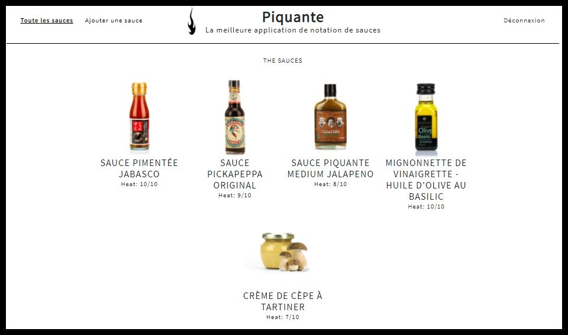

<P align="center">
</p>

<h1 align="center">So Pekocko - Projet 6</h1>
<p align="center">Construire une API sécurisée pour une application d'avis gastronomique</p></br>

<details open="open">
  <summary>Sommaire</summary>
  <ol>
    <li>
      <a href="#apropos">À propos du Site</a>
      <ul>
        <li><a href="#outils">Outils utilisés</a></li>
        <li><a href="#doc">Documentation</a></li>
      </ul>
    </li>
    <li>
      <a href="#demarrage">Démarrage</a>
      <ul>
        <li><a href="#prerequis">Prérequis</a></li>
        <li><a href="#installation">Installation</a></li>
      </ul>
    </li>
    <li><a href="#dependence">Dépendences NPM</li> 
    <li><a href="#contact">Contact</a></li>
  </ol>
</details>

<h2 id="apropos" align="center">À propos du Site</h2>

<p align="center"></p>

<p align="center">So Pekocko est une entreprise familiale de 10 salariés. Son activité principale est la création
de sauces piquantes dont la composition est tenue secrète. Forte de son succès, l’entreprise
souhaite se développer et créer une application web, dans laquelle les utilisateurs pourront
ajouter leurs sauces préférées et liker ou disliker les sauces proposées par les autres.
</p>

<h3 id="outils">Outils utilisés</h3>

<p>Pour réaliser ce site, différents outils ont été utilisés afin qu'il soit fonctionnel côté Frontend comme côté Backend.</p>

* [Angular CLI](https://github.com/angular/angular-cli) (version 7.0.2)

* [Node.JS](https://nodejs.org/en/blog/release/v14.15.1/) (version 14.15.1)

* [MongoDB Atlas](https://www.mongodb.com/try) (Base de donnée)

<h3 id="doc">Documentation</h3>

<p>Lors de la réalisation du site, plusieurs régles ont dût être respectées. Ci-dessous les différents documents.</p>

* [Cahier des charges](./images_readme/Guidelines+API.pdf)

* [Note de cadrage](./images_readme/P6_Note_cadrage.pdf)

<h2 id="demarrage" align="center">Démarrage</h2>

<h3 id="prerequis">Prérequis</h3>

<p>Afin de pouvoir utiliser l'application, nous devons cloner le projet disponible sur GitHub vers le dossier de votre choix.</p>

   ```sh
   git clone https://github.com/KevinAudibert/So_Pekocko.git
   ```

<p>:warning: **WARNING** :wraning:</p>
<p>Il sera necessaire de créer un fichier `.env` dans le dossier **backend** afin d'avoir accès à la Base de données **MongoDB**.</p>

<h3 id="installation">Installation</h3>

<p>Le projet contient plusieurs parties qui doivent être configurées pour le bon fonctionnement de l'application.</p>

<h4>Frontend :</h4>

1. Ouverture d'un Terminal depuis votre IDE
    `Ctrl+Maj+ù`

2. Ciblage du dossier Frontend du projet
    ```console
    cd frontend
    ```
3. Installation des Packages NPM 
   ```console
   npm install
   ```

4. Démarrage du Server de développement
   ```console
   ng serve
   ```

<h4>Backend :</h4>

1. Ouverture d'un nouveau Terminal depuis votre IDE
    `Ctrl+Maj+ù`

2. Ciblage du dossier Backend du projet
    ```console
    cd backend
    ```
3. Installation des Packages NPM 
   ```console
   npm install
   ```

4. Démarrage du Server
   ```console
   nodemon server
   ```

<h2 id="dependence" align="center">Dépendences NPM</h2></br>

| Dependances NPM          | Description                                      | Documentation |
|--------------------------|--------------------------------------------------|---------------|
| bcrypt                   | Cryptage des mots de passe                       |[bcrypt](https://www.npmjs.com/package/bcrypt)|
| body-parser              | Parse des données JSON                           |[body-parser](https://www.npmjs.com/package/body-parser)       |
| dotenv                   | Sécurisation des données accès BDD               |[dotenv](https://www.npmjs.com/package/dotenv)       |
| express                  | Framework pour application                       |[express](https://www.npmjs.com/package/express)       |
| helmet                   | Sécurisation de l'application express            |[helmet](https://www.npmjs.com/package/helmet)       |
| jsonwebtoken             | Création de TOKEN                                |[jsonwebtoken](https://www.npmjs.com/package/jsonwebtoken)       |
| mongoose                 | Modélisation d'objets MongoDB                    |[mongoose](https://www.npmjs.com/package/mongoose)       |
| mongoose-unique-validator| Validation de champs unique d'un Schéma Mongoose |[mongoose-unique-validator](https://www.npmjs.com/package/mongoose-unique-validator)       |
| multer                   | Téléchargement de fichiers                       |[multer](https://www.npmjs.com/package/multer)       |
| password-validator       | Valide Mot de passe selon spécifications         |[password-validator](https://www.npmjs.com/package/password-validator)       |


<h2 id="contact" align="center">Contact</h2>

Adresse Email : [Kevin.audibert26@gmail.com](mailto:kevin.audibert26@gmail.com)

Lien du Projet: [https://github.com/KevinAudibert/So_Pekocko](https://github.com/KevinAudibert/So_Pekocko)